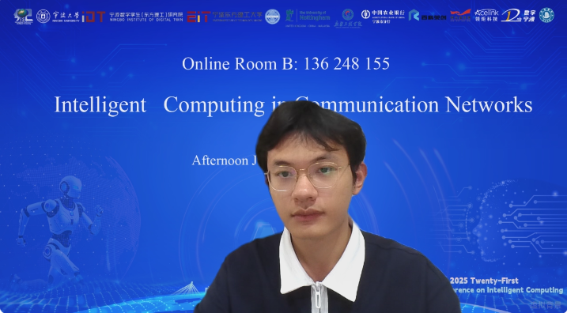
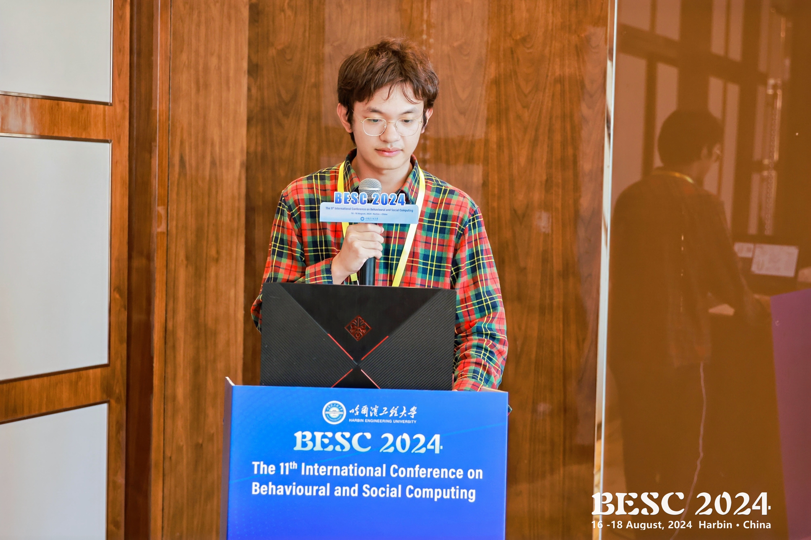

My name is **Jiacheng Han (韩家成)**.

I'm a fourth-year undergraduate student from the School of Computer Science, **Beijing Information Science & Technology University**. 

My research interests include **Medical Image Processing** and **Computer Vision**. I am very fortunate to be advised by [Prof. Ke Niu](https://jiacheng-han.github.io/), Beijing Information Science and Technology University.

## 📢 News and Plans

* **[Sep. 2025]** I have been recommended for postgraduate studies at **Southeast University**. 🎓
* **[Present]** I am currently enjoying my gap year vacation! 🏖️

## 🎓 Education

* **2022.09 - present**: B.S. major in Computer Science and Technology, minor in Big Data, *Beijing Information Science & Technology University*, Beijing.

## 📝 Publications

### 2025 (Third-year undergraduate)

* **MedMaskDiff: Mamba-based Medical Semantic Image Synthesis for Segmentation** **Jiacheng Han**, *Ke Niu*, Jiuyun Cai.  
    *International Conference on Intelligent Computing (ICIC).* (CCF-C)  
    [[GitHub](https://github.com/Jiacheng-Han/MedMaskDiff)]

* **CFM-UNet: coupling local and global feature extraction networks for medical image segmentation** *Ke Niu*, **Jiacheng Han**, Jiuyun Cai.  
    *Scientific Reports.* (JCR Q1)  
    [[GitHub](https://github.com/Jiacheng-Han/CFM-UNet)]

### 2024 (Second-year undergraduate)

* **PESAM: Privacy-Enhanced Segment Anything Model for Medical Image Segmentation** Jiuyun Cai, *Ke Niu*, Yijie Pan, Wenjuan Tai, **Jiacheng Han**.  
    *International Conference on Intelligent Computing (ICIC).* (CCF-C)

* **GM-UNet: GAN-Based VM-UNet Achieves Higher Accuracy** ***Jiacheng Han***, *Jiuyun Cai*, Mohan Zhu, Zijie Gao, Cong Li, Yuanyuan Miao.  
    *2024 11th International Conference on Behavioural and Social Computing (BESC).* (EI Conference)  
    [[GitHub](https://github.com/Jiacheng-Han/GM-UNet)]

## 🏆 Awards

* **Bronze Medal**, The 2024 ICPC Asia Kunming Regional Contest
* **Bronze Medal**, 2024 China Collegiate Programming Contest, Harbin Site
* **Bronze Medal**, 2024 China Collegiate Programming Contest - National Invitational Contest (Shandong)
* **Meritorious Winner (Top 10%)**, 2024 Mathematical Contest In Modeling
* **Second Prize (Top 30%)**, 2023 Asia and Pacific Mathematical Contest in Modeling

## 🗣️ Academic Activities

* **2025.7**: 2025 International Conference on Intelligent Computing (ICIC) - *Ningbo, China*.  
    

* **2024.8**: 11th International Conference on Behavioural and Social Computing (BESC) - *Harbin, China*.  
    

## 🔍 Reviewer Service

* IEEE Journal of Biomedical and Health Informatics (JCR Q1 / CCF-C)
* IEEE International Conference on Multimedia & Expo 2025 (CCF-B)

## 💻 Internships

* **[AK OPTICS](https://www.akoptics.com/)** (2025.10 - 2025.12)
